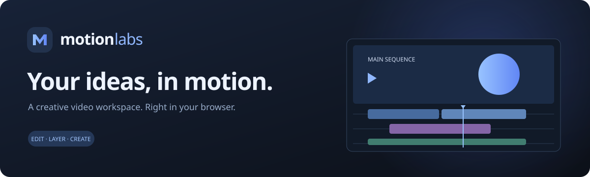
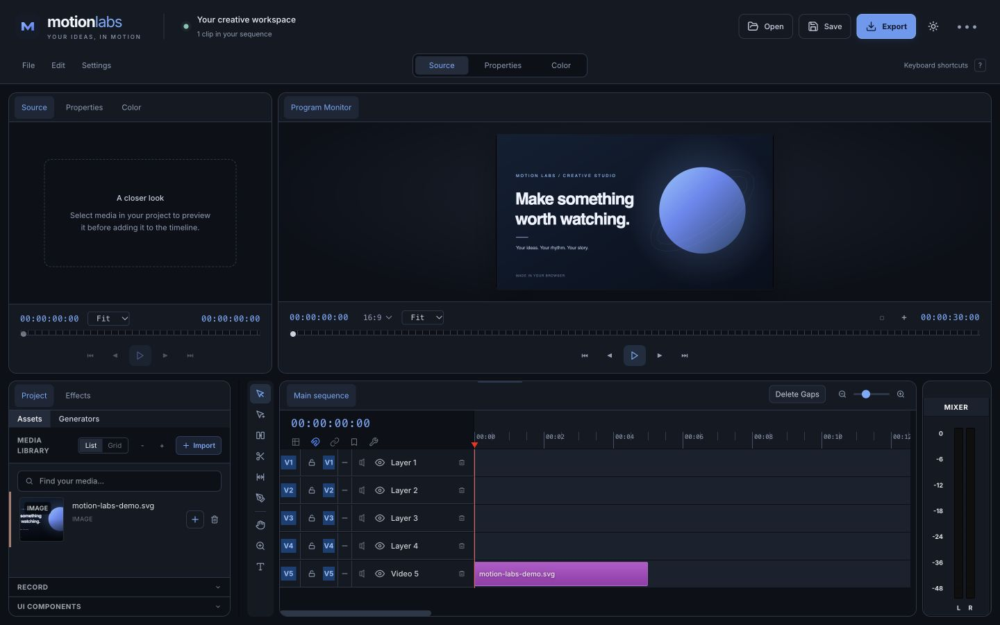
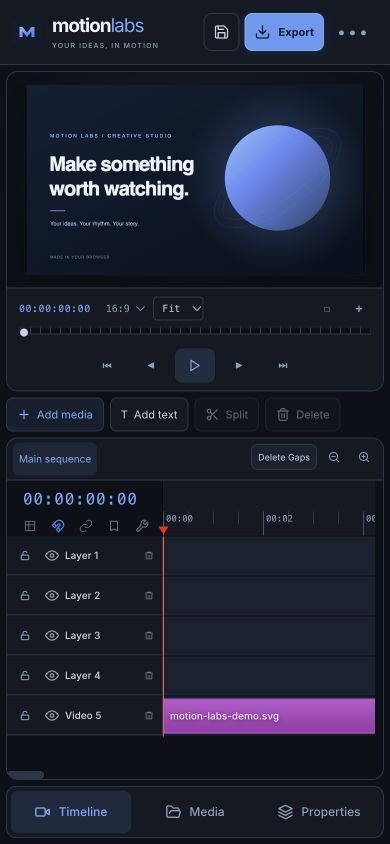

<div align="center">



**A creative video workspace, right in your browser.**

Cut footage. Layer sound. Add a title. Make it yours.

[**Open the studio ↗**](https://motionlabzz.netlify.app/) · [Your first edit](#your-first-edit) · [Run locally](#run-locally) · [Inside the project](#inside-the-project)

</div>

---

## Meet your workspace

Motion Labs brings a familiar multi-track editing workflow to a quieter, more focused interface. Charcoal panels, soft blue accents, and a matching light theme keep your footage at the center. On a phone or tablet, the studio becomes a compact workspace with a persistent preview, quick editing actions, and **Timeline / Media / Properties** navigation.

| Desktop studio | Mobile workspace |
| :---: | :---: |
|  |  |

## Your first edit

1. **Bring in your media.** Choose **Add media** in the preview, or **Import** in the media library. On desktop, you can also drop files into the library. Search by filename and switch between list and grid views.
2. **Build your sequence.** Use the **+** beside an asset to add it to the timeline. Desktop users can also drag media onto a track or double-click an asset. Video imports create linked video and audio clips.
3. **Make it yours.** Select a clip, open **Properties**, and adjust its position, size, styling, sound, or transitions. Use **Color** for grading. Set a landscape, portrait, or square aspect ratio beside the preview timecode.
4. **Find your rhythm.** Move and trim clips, split at the playhead, snap to nearby edges, and add markers. On smaller screens, **Add text**, **Split**, and **Delete** sit directly below the preview; scroll the action row if needed.
5. **Save or share.** **Save** downloads a portable `.motionlabs` project with its media. **Open** restores it. **Export** opens video/audio settings with the formats your browser supports.

> Your media library and editing state are also stored locally in IndexedDB. Download a project file when you want a backup or want to move your work to another device.

## Room to create

| In the studio | What you can do |
| --- | --- |
| **Timeline** | Edit across video and audio tracks, select multiple clips, trim and split, close gaps, use ripple editing, and place markers. |
| **Preview** | Play and scrub your sequence, choose an aspect ratio, move and resize items on the canvas, and toggle safe margins or center guides. |
| **Media library** | Import footage, images, and audio; search filenames; preview thumbnails; adjust thumbnail sizes; and add clips with a visible button. |
| **Sound** | See real waveforms, work with linked video/audio clips, separate audio, and use desktop audio meters. |
| **Titles & layers** | Add text, shapes, adjustment layers, and transitions. Customize selected elements in Properties. |
| **Capture** | Record a camera, microphone, or screen, or capture a photo when your browser and device support it. |
| **Export** | Choose resolution presets from 720p to 4K, set a frame rate, and export video or audio using supported browser formats. |
| **AI tools** | Generate components or images with your own Gemini API key. Ordinary editing works without a key. |
| **Your workspace** | Resize desktop panels, use a compact layout below 960px, and switch between dark and light themes. |

**Need a shortcut?** Open **Edit → Keyboard shortcuts** on desktop or **••• → Keyboard shortcuts** on mobile. Undo and redo are also available from those menus.

## Run locally

Use a current Node.js LTS release and npm.

```bash
git clone https://github.com/RonitGandotra05/motion-labs.git
cd motion-labs
npm ci
npm run dev
```

Open the local URL printed by Vite (port `3000` by default).

```bash
npm run typecheck   # Check TypeScript
npm run build       # Create the production app in dist/
npm run preview     # Preview the production build
```

Styles are compiled locally with Tailwind and PostCSS, so the editor does not depend on a runtime styling CDN. The AI SDK loads when a generation tool is used.

### Optional AI setup

Open **Settings** or **••• → Settings & AI key**, enter your Gemini API key, and save it. The key is stored in your browser's local storage; generation requests go directly to Gemini. No key is needed to import, edit, save, or export your own media.

### Deploy

The app builds into static files in `dist/`. The included `netlify.toml` sets **`npm run build`** as the build command and **`dist`** as the publish directory. You can also serve that directory with another static host.

## Inside the project

Built with **React 19**, **TypeScript**, **Vite**, and **Tailwind CSS**, using browser media APIs, canvas rendering, and IndexedDB.

```text
App.tsx                 Editor state, responsive workspace, editing actions
styles.css              Shared palette, panel styles, responsive layout
components/
  panels/               Media, properties, color, source, audio, settings
  preview/              Program monitor and interactive canvas
  timeline/             Tracks, clips, ruler, waveforms, editing controls
  ui/                   Header, transport, tools, dialogs, export settings
services/               Optional Gemini generation tools
utils/                  Project files, storage, history, export pipelines
public/                 Studio icon
docs/                   README artwork and workspace screenshots
```

## A few practical details

- **Format support varies.** An extension being accepted does not guarantee that a browser can decode it. Use media your browser supports; recording and video export depend on its media APIs and codecs.
- **Capture needs permission.** Camera, microphone, and screen recording require browser permission and a secure context such as HTTPS or localhost. Screen capture is usually a desktop workflow.
- **Local work stays in this browser.** Clearing site data removes the local media library and saved editing state. A downloaded project file is your portable backup.
- **AI is optional.** Generation needs a valid key, network access, and an available model. Standard editing does not need Gemini.

---

<div align="center">

**Less friction. More making.**

[Start your next story in Motion Labs ↗](https://motionlabzz.netlify.app/)

</div>
